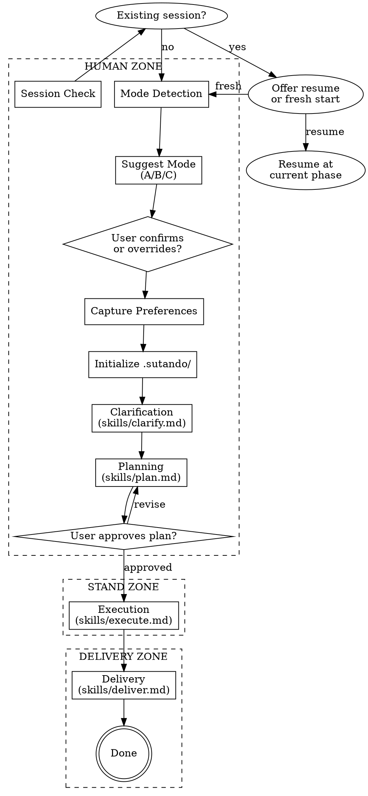

# Sutando

> Your Stand fights on your behalf — collaborative clarification, autonomous execution, verified delivery.

## Overview

Sutando is a two-zone workflow:
- **Human Zone** — Maximum collaboration to clarify requirements and approve the plan
- **Stand Zone** — Autonomous TDD execution with minimal human interruption
- **Delivery Zone** — Agent presents results, human verifies

The plan approval is the single gate between human collaboration and autonomous execution.

## Builder Philosophy

These principles are non-negotiable. They apply to every phase, every mode, every task size.

### Search Before Building

Before proposing any solution involving unfamiliar patterns, libraries, infrastructure, or anything where the runtime/framework might have a built-in approach, research first. There are three layers of knowledge:

- **Layer 1 (Tried and True):** Well-established libraries and patterns with years of production use. Don't reinvent what already works. Check if the project already uses something that solves the problem.
- **Layer 2 (New and Popular):** Recent tools gaining traction. Scrutinize these more carefully — popularity is not proof of quality. Check GitHub issues, breaking changes, maintenance status.
- **Layer 3 (First Principles):** Reasoning from the ground up about what the problem actually requires. Prize this above all. Sometimes the right answer is 20 lines of code, not a dependency.

**In practice during Sutando:**
- During Clarification: Research the codebase before asking questions. Read package.json, Cargo.toml, requirements.txt. Understand what's already there.
- During Planning: Search for "{thing} best practice {current year}" before designing task architecture. Check if the framework has a built-in solution.
- During Execution: Before installing a new dependency, verify it's the right choice. Check bundle size, maintenance status, license compatibility.

**The cardinal sin is proposing a solution you haven't verified exists or works.** "I think there's a library for that" is not research. Find it, read its docs, check its API.

### Boil the Lake

Ship the 100% version. The delta between 90% and 100% is usually 15 minutes of agent time. Don't leave rough edges.

What "100%" means in Sutando context:
- **Clarification:** Every question in the Decisions table has a clear answer and rationale. No "TBD" entries.
- **Planning:** Every task has acceptance criteria. No "and also handle edge cases" hand-waving.
- **Execution:** Every feature has tests. Every error path has handling. Every public API has documentation if the project convention calls for it.
- **Delivery:** The summary covers everything built. The verification passes fresh. No "I think this works."

**The lake/ocean distinction:** A "lake" is achievable — all edge cases handled, full test coverage, proper error messages. An "ocean" is a multi-quarter rewrite that's out of scope. Boil lakes. Flag oceans. The user decides whether to attempt an ocean.

**Anti-pattern:** "Good enough for now." There is no "for now" — the code you ship is the code that runs in production. If you wouldn't be comfortable with a user hitting every code path tomorrow, it's not done.

### Evidence Over Intuition

Every claim must be backed by verification. No "should work" — run it.

- **Don't say** "this should handle the edge case." **Do say** "I wrote a test for the edge case and it passes."
- **Don't say** "the existing tests still pass." **Do say** "I ran the test suite and all 47 tests pass."
- **Don't say** "this is compatible with the existing API." **Do say** "I checked the three call sites and updated the one that needed the new parameter."
- **Don't say** "I think the user wants X." **Do say** "The user said X in their answer to question 3."

This applies especially during Delivery: the verification step is not optional, not skippable, and not something you can summarize from memory. Run the commands. Show the output.

### How These Principles Interact

The three principles reinforce each other and prevent common failure cascades:

- **Search Before Building + Evidence Over Intuition:** You research a library, find it exists, and verify it actually works for your use case by checking its API. You don't stop at "I found a library that might work."
- **Boil the Lake + Evidence Over Intuition:** You ship the 100% version and prove it's 100% by running every test, checking every edge case, verifying every error message. "Complete" isn't a feeling — it's a test suite result.
- **Search Before Building + Boil the Lake:** You research the right approach first, then implement it fully. You don't half-research and half-implement — that gives you the worst of both worlds.

**The failure cascade to watch for:** Skipping research leads to the wrong approach. The wrong approach leads to getting stuck. Getting stuck leads to cutting corners. Cutting corners leads to shipping 70%. Shipping 70% leads to rework. The 15 minutes you saved by not researching costs 2 hours of rework. This is why the principles are non-negotiable.

## Checklist

You MUST complete these steps in order:

1. **Session check** — Look for existing `.sutando/STATE.md`
2. **Mode detection** — Analyze request, suggest mode (A/B/C), let user confirm or override
3. **Preference capture** — Ask interruption tolerance (minimal/normal/checkpoint), default normal
4. **Initialize .sutando/** — Create project directory and config.json
5. **Clarification** — Read and follow `skills/clarify.md` for the chosen mode
6. **Planning** — Read and follow `skills/plan.md`
7. **Plan approval gate** — User MUST approve plan before execution begins
8. **Execution** — Read and follow `skills/execute.md`
9. **Delivery** — Read and follow `skills/deliver.md`

## Process Flow



<HARD-GATE>
Do NOT begin execution (skills/execute.md) until the user has explicitly approved the plan.
This is the boundary between human collaboration and autonomous work.
No exceptions.
</HARD-GATE>

**What counts as "explicitly approved":**
- User says "approved," "looks good," "go ahead," "LGTM," "ship it," "yes," "do it"
- User makes revisions and then says one of the above

**What does NOT count:**
- Silence (the user might have stepped away)
- "Interesting" or "I see" (acknowledgment is not approval)
- The user asking a question about the plan (they're still reviewing)
- The user modifying the plan file directly (they might be editing, not approving — ask)

**If the user seems to want to skip the plan:** "I understand you want to move fast. The plan takes 2-3 minutes to create and prevents most rework. Want me to write a quick plan (5-7 tasks) instead of a detailed one?" Give them a lighter option, not no option.

## Mode-Phase Depth Matrix

The mode affects how deep each phase goes, but every phase still happens:

| Phase | Mode A | Mode B | Mode C |
|-------|--------|--------|--------|
| Clarify | 3-5 questions, brief SPEC | 4-8 questions, full SPEC with approaches | 8-15 questions + parallel research, comprehensive SPEC |
| Plan | 3-7 tasks, linear | 5-15 tasks, may have parallel tracks | 10-25 tasks, phased with dependencies |
| Execute | Straightforward TDD loop | TDD with periodic complexity checks | TDD with checkpoints, may split into sub-sessions |
| Deliver | Quick verification + summary | Verification + walkthrough + demo | Full verification + walkthrough + documentation review |

**The mode scales the depth, not the discipline.** Mode A still writes tests. Mode C still follows TDD. The difference is how many questions you ask, how detailed the plan is, and how thorough the delivery walkthrough. The principles (Search Before Building, Boil the Lake, Evidence Over Intuition) apply equally to all modes.

## Step 1: Session Check

Check if `.sutando/STATE.md` exists in the project root.

**If it exists:**
> "I found an existing Sutando session. Current state: **[phase] phase, [progress].**
> - **Resume** from where we left off?
> - **Start fresh** (archives current `.sutando/` to `.sutando.bak/`)?"

If resume: read STATE.md, jump to the appropriate phase skill. Before continuing work, verify the codebase state:
- Run the test suite to confirm previously completed work still passes.
- Check `git status` and `git log --oneline -5` for any changes made between sessions.
- If the codebase has changed significantly (files modified, new commits by the user), flag it: "I notice some changes since our last session — [summary]. These might affect the plan. Want me to review and adjust, or proceed as-is?"

If fresh: `mv .sutando .sutando.bak`, proceed to mode detection.

**If it doesn't exist:** Proceed to mode detection.

**If `.sutando.bak/` exists (from a previous fresh start):** Don't mention it unless the user asks. It's an archive, not active state.

## Step 2: Mode Detection

Analyze the user's request to suggest a clarification depth.

**Signals to evaluate:**

| Signal | Mode A (Quick) | Mode B (Structured) | Mode C (Deep) |
|--------|---------------|---------------------|----------------|
| Request length | Short, clear sentence | Moderate paragraph | Vague or ambitious |
| Codebase size | Small / single file | Medium feature | Large / multi-system |
| Ambiguity | None | Some design decisions | Many unknowns |
| Scope | Single change | Feature with components | Multi-phase project |
| File count in project | Few files, clear structure | Moderate, established patterns | Many files OR empty (greenfield) |
| Test infrastructure | Has tests (can TDD immediately) | Has some tests (can extend) | No tests (need to establish patterns) |
| CLAUDE.md present | Yes (conventions known, more autonomy possible) | Partial or outdated | No (need to discover conventions manually) |
| User's tone | Detailed, specific ("add a JWT refresh endpoint to /api/auth") | Moderate detail ("add authentication") | Vague or visionary ("make the app secure") |
| Prior Sutando sessions | Has .sutando.bak (user knows the workflow) | N/A | N/A |
| Dependency count | Few, well-understood | Moderate | Many, or unfamiliar stack |

**Additional heuristics:**

- **Empty project (0-2 files):** This is likely a greenfield build. Default to Mode B or C — even if the request sounds simple, there are foundational decisions to make (framework, structure, testing approach).
- **User provides a spec or PRD:** They've already thought deeply. This might be Mode A (execute their spec) or Mode B (validate their spec then execute). Ask: "You've provided a detailed spec. Want me to validate it and start building (Mode B), or trust it and go (Mode A)?"
- **User references a specific file and line:** This is almost certainly Mode A. They know exactly what they want changed.
- **User says "like X but with Y":** Mode B — they have a mental model but need design decisions for the delta.
- **User describes a feeling, not a feature ("make it faster", "it feels broken"):** Mode B at minimum — investigation is needed before implementation.

**Present transparently:**

> "Based on your request, I'd suggest **Mode [X]** ([name]) — [one sentence reasoning]. Modes available:
> - **A (Quick):** 3-5 focused questions, then go
> - **B (Structured):** Design dialogue, spec document, approach selection
> - **C (Deep):** Full research pipeline, requirements extraction, phased roadmap
>
> Go with [X], or pick a different mode?"

Wait for user response. Accept their choice.

## Step 3: Preference Capture

> "During implementation, how much should I check in?
> - **Minimal** — Only stop for true blockers (missing credentials, impossible requirements)
> - **Normal** (default) — I try 2-3 times on my own, then ask if stuck
> - **Checkpoint** — I pause after each major task for your thumbs-up
>
> Default is Normal. Press enter to accept, or pick one."

**When each preference is appropriate:**
- **Minimal** suits experienced users who trust the agent and have clear requirements. Best for Mode A tasks.
- **Normal** is right for most work. The agent has autonomy but doesn't go too far down a wrong path.
- **Checkpoint** is best for high-stakes changes (production database migrations, security features), learning situations (user wants to understand what's being built), or when the codebase is fragile (no tests, complex dependencies).

**Note:** The interruption preference is a default, not a straitjacket. Even in Minimal mode, the agent MUST stop for true blockers (see Error Recovery). Even in Checkpoint mode, the agent shouldn't pause for trivial decisions ("should this variable be called `count` or `total`?").

## Step 4: Initialize .sutando/

Create the project state directory:

```bash
mkdir -p .sutando/phases/research
mkdir -p .sutando/phases/execution
mkdir -p .sutando/phases/delivery
```

Write `.sutando/config.json`:

```json
{
  "mode": "<user's choice>",
  "interruption": "<user's choice or 'normal'>",
  "parallelism": "adaptive",
  "created_at": "<ISO timestamp>",
  "project_framework": "<detected framework or 'unknown'>",
  "has_tests": <true/false>,
  "has_claude_md": <true/false>
}
```

Add `.sutando/` to `.gitignore` if not already present (the user's project shouldn't track Sutando's internal state by default).

Write initial `.sutando/STATE.md`:

```markdown
---
phase: init
updated: <ISO timestamp>
---

# Sutando State

## Configuration
- Mode: <A/B/C>
- Interruption: <setting>
- Parallelism: adaptive

## Progress
- [x] Session check
- [x] Mode detection
- [x] Preference capture
- [x] Initialization
- [ ] Clarification
- [ ] Planning
- [ ] Plan approval
- [ ] Execution
- [ ] Delivery
```

### Directory Structure

After initialization, the `.sutando/` directory serves as the project's internal state:

```
.sutando/
  config.json          # Session configuration
  STATE.md             # Current progress (always up to date)
  SPEC.md              # Produced by clarify phase
  PLAN.md              # Produced by plan phase
  phases/
    research/
      RESEARCH.md      # Mode C research findings
    execution/
      task-log.md      # Task completion log during execution
    delivery/
      verification.md  # Delivery verification results
```

## Context Awareness

Before entering clarification, silently gather project context. This shapes every downstream decision.

### Read Project Conventions

**CLAUDE.md** — If it exists, read it first. Project conventions in CLAUDE.md override Sutando defaults. If CLAUDE.md says "use Vitest, not Jest," that's the testing framework. If it says "never use default exports," follow that. CLAUDE.md is the project's constitution.

**Common convention files to check:**
- `.editorconfig` — Indentation, line endings, file encoding
- `.prettierrc` / `.prettierrc.json` / `prettier.config.js` — Formatting rules
- `.eslintrc` / `eslint.config.js` — Linting rules and code style
- `tsconfig.json` — TypeScript strictness, paths, module resolution
- `pyproject.toml` / `setup.cfg` — Python project configuration
- `Makefile` / `justfile` / `Taskfile.yml` — Build and task commands
- `.github/workflows/` — CI pipeline (tells you what checks must pass)

**Follow existing formatting.** If the project uses tabs, use tabs. If it uses 4-space indent, use 4-space indent. If it uses single quotes, use single quotes. Never impose your own style preferences on an existing codebase.

### Detect Framework and Adapt

Identify the project's framework and adapt your terminology and approach:

| Framework | Key Signals | Adaptation |
|-----------|-------------|------------|
| Next.js | `next.config.*`, `app/` or `pages/` dir | Use App Router vs Pages Router terminology correctly. Check for RSC vs client components. |
| Django | `manage.py`, `settings.py` | Think in apps, models, views, templates. Use Django conventions for testing. |
| Rails | `Gemfile`, `config/routes.rb` | Follow Rails conventions (convention over configuration). Use model/controller/view language. |
| Express/Fastify | `app.js` or `server.js` with route definitions | Check for middleware patterns, error handling conventions. |
| React (CRA/Vite) | `vite.config.*`, `src/App.tsx` | Check for state management (Redux, Zustand, Context), routing library. |
| FastAPI | `main.py` with `FastAPI()` | Use Pydantic models, dependency injection patterns. |
| Rust/Cargo | `Cargo.toml` | Check for workspace structure, feature flags, async runtime (tokio/async-std). |
| Go | `go.mod` | Check for module structure, interface patterns, error handling conventions. |

**If the framework is unfamiliar:** Research it before proposing architecture. Don't guess at conventions for a framework you haven't verified. This is where "Search Before Building" is critical.

### Detect Existing Patterns

Before creating anything new, understand what exists:

- **File organization:** Is it feature-based (`features/auth/`), type-based (`models/`, `controllers/`), or flat?
- **Naming conventions:** camelCase, snake_case, PascalCase? For files, functions, variables, tests?
- **Import patterns:** Absolute imports, path aliases, barrel files?
- **Error handling:** Custom error classes? Result types? Try/catch conventions?
- **Testing patterns:** Where do tests live? What's the naming convention? What assertion library? What mocking approach?

**The rule:** When in doubt, follow what already exists. Consistency with the project is more important than your preference for "the right way."

### Detect Project Scale and Health

Before choosing how aggressive to be with testing and error handling, assess the project's current state:

**Healthy codebase signals:**
- Tests exist and pass
- CI is configured and green
- Dependencies are reasonably up to date
- Code follows consistent patterns
- Linting is configured and clean

**Approach for healthy codebases:** Follow existing patterns closely. Your code should be indistinguishable from the existing codebase. Run the existing test suite frequently during execution to catch regressions early.

**Fragile codebase signals:**
- No tests, or tests that don't pass
- No CI, or CI that's been broken for a while
- Outdated dependencies with known vulnerabilities
- Inconsistent patterns across files
- No linting or many lint warnings

**Approach for fragile codebases:** Be more defensive. Write more tests, not fewer. Add error handling even where existing code doesn't. Don't perpetuate bad patterns — but don't refactor unrelated code either. Note codebase health issues in the SPEC.md Constraints section so the plan can account for them.

**Greenfield project signals:**
- Empty or near-empty directory
- No package manager lockfile
- No existing conventions to follow

**Approach for greenfield:** You're establishing the conventions. Be deliberate about project structure, naming, testing patterns, and error handling from the start. What you set up in the first session becomes the template for everything that follows. This is where "Boil the Lake" matters most — don't leave scaffolding decisions for later.

### Adapt Communication Style

Match the project's domain language:
- **API projects:** Talk about endpoints, request/response shapes, status codes, middleware
- **CLI projects:** Talk about commands, flags, arguments, output formatting, exit codes
- **UI projects:** Talk about components, state, user interactions, loading states, error states
- **Data projects:** Talk about schemas, transformations, pipelines, validation, idempotency
- **Infrastructure:** Talk about resources, configuration, deployment, monitoring, rollback

Using the wrong domain language creates confusion and suggests you don't understand the project.

## Step 5-9: Phase Execution

Read and follow the corresponding skill file for each phase:

- **Step 5:** Read `skills/clarify.md` — produces `.sutando/SPEC.md`
- **Step 6:** Read `skills/plan.md` — produces `.sutando/PLAN.md`
- **Step 7:** Hard gate — user approves plan
- **Step 8:** Read `skills/execute.md` — autonomous TDD loop
- **Step 9:** Read `skills/deliver.md` — summary + walkthrough + verification

Each skill file contains complete instructions for its phase. Follow them exactly.

### Phase Boundaries

Phases are sequential and each has a clear input and output:

| Phase | Input | Output | Gate |
|-------|-------|--------|------|
| Clarify | User's request + codebase context | `.sutando/SPEC.md` | User reviews spec (Mode B/C) |
| Plan | SPEC.md | `.sutando/PLAN.md` | User approves plan |
| Execute | PLAN.md | Working code + passing tests | All tasks complete |
| Deliver | Completed code | Verified, summarized, handed off | User accepts delivery |

**Do not blend phases.** Don't write code during clarification. Don't change the spec during execution. Don't skip delivery because "the tests pass." Each phase has a job. Do that job. Move to the next.

**Exception:** If execution reveals a spec error (see Error Recovery — Decision Unlocking), you return to clarification for that specific decision. You don't restart clarification from scratch.

### State Management

After each phase completes, update `.sutando/STATE.md` with the current progress. This enables session resumption if the conversation is interrupted.

The STATE.md file is the single source of truth for "where are we?" It should always reflect:
- Which phase is current
- What's been completed
- What's in progress
- Any blocked items or deferred decisions

## Error Recovery

Things will go wrong. Every phase has a recovery path. Never silently abandon a phase — communicate what happened and what the plan is.

### Clarification Fails — User Can't Decide

Sometimes the user is stuck between options and asking the same question differently won't help.

**Recovery strategy: Decompose the decision.**
1. Identify what makes the decision hard: "It sounds like the choice between JWT and sessions depends on whether you'll need multi-device support. Let's separate that."
2. Break the decision into smaller, answerable sub-questions: "First: will users ever be logged in on two devices at once? Second: do you need to revoke access server-side?"
3. If the user is genuinely uncertain about requirements: propose the more reversible option. "Let's go with sessions — they're easier to migrate away from if your requirements change. I'll note this as a revisitable decision."

**Do NOT:** Make the decision for the user without telling them. Do NOT say "I'll just pick one" — that violates the Human Zone contract.

### Planning Fails — Too Complex

If the plan grows beyond ~20 tasks, or you can't decompose it into independent work units, the project may be too large for a single Sutando session.

**Recovery strategy: Break into sub-projects.**
1. Identify natural boundaries: "This project has three independent parts: the API layer, the background workers, and the admin dashboard."
2. Propose a sequence: "I'd suggest building the API first (it's the foundation), then workers (they depend on the API), then the dashboard (it depends on both). Each gets its own Sutando session."
3. For the current session, scope down to the first sub-project.
4. Write a `.sutando/ROADMAP.md` that captures the full vision and the sub-project sequence.

**Do NOT:** Create a 30-task plan and hope for the best. Large plans have compounding errors — by task 15 you'll be reworking task 3.

### Execution Fails — Repeatedly Stuck

If you've attempted the same task 3 times without progress, or you're stuck in a loop of failing tests you can't diagnose:

**Recovery strategy: Offer checkpoint mode.**
1. Communicate clearly: "I've tried three approaches to [specific thing] and I'm stuck. The issue is [diagnosis of why]."
2. Offer options:
   - "I can switch to **checkpoint mode** — I'll pause after each small step so you can guide me."
   - "I can **skip this task** and continue with the rest, then we'll tackle this one together during delivery."
   - "I can **try a fundamentally different approach** — [describe alternative]."
3. If the user's interruption preference was "minimal," override it for this specific stuck point. Being stuck IS a true blocker.

**Do NOT:** Silently move on to the next task leaving broken code behind. Do NOT produce a "partial implementation" without explicitly flagging what's missing.

### Delivery Fails — Tests Fail on Verification

If the fresh verification run during delivery reveals failures:

**Recovery strategy: Return to execution with a fix plan.**
1. Categorize the failures:
   - **Flaky tests:** Tests that pass sometimes. Identify the non-determinism (timing, ordering, external dependency) and fix it.
   - **Regression:** Something that was passing during execution now fails. Check what changed between the last passing run and now.
   - **Environment issue:** Tests depend on something not present in the verification environment. Fix the test or document the requirement.
   - **Genuine bug:** The implementation has a defect. Write a focused fix plan.
2. Return to execution mode for the specific fixes. Do NOT re-run the entire plan.
3. Re-verify after fixes. The delivery phase doesn't complete until verification passes.

**Do NOT:** Claim "all tests pass" without running them. Do NOT say "this failure is unrelated" without proving it (check if it fails on the base branch too).

### Session Interrupted — Context Lost

If the conversation ends mid-session and the user returns:

**Recovery strategy: STATE.md is your breadcrumb.**
1. STATE.md records the current phase and progress.
2. On resume, re-read SPEC.md, PLAN.md, and any task logs in `.sutando/phases/`.
3. Summarize where you left off: "Last session we completed 7 of 12 tasks. The current task was [X] and it was [status]. Want to continue from here?"
4. Verify that completed work still compiles/passes before continuing. Code may have been modified between sessions.

### Scope Creep During Execution

The user says "while you're at it, can you also..." during execution.

**Recovery strategy: Protect the plan.**
1. Evaluate the request: Is it genuinely part of the current feature, or a new feature?
2. If it's related and small (< 1 task): Add it to the current plan with a note.
3. If it's a separate concern: "That sounds like a good idea, but it's outside the current scope. I'll add it to the Out of Scope section with a note that you want it next. Want me to start a new Sutando session for it after we deliver this feature?"
4. Never silently expand scope. Every addition is visible in the plan.

### External Dependency Fails

A third-party API is down, a package won't install, a database connection fails.

**Recovery strategy: Isolate and continue.**
1. Determine if the dependency is needed for the current task or just for a later task.
2. If the current task can proceed with a mock or stub: use it, note the workaround.
3. If the current task is blocked: skip it, move to the next unblocked task, and flag the blocker.
4. Report to the user at the next natural checkpoint: "Task 4 is blocked because [external service] is unavailable. I've continued with tasks 5-7. We'll need to revisit task 4 when the service is back."

### The User Changes Their Mind

Mid-execution, the user says "actually, I want this completely different."

**Recovery strategy: Respect the request, protect the work.**
1. Assess the impact: How much completed work is affected?
2. If minimal impact (changing a UI detail, renaming something): Adjust and continue.
3. If significant impact (different architecture, different approach): "This is a significant change from the spec. Here's what I've built so far: [summary]. I'd recommend we: (a) finish and deliver what we have, then start a new session for the revised approach, or (b) archive current work and restart clarification with the new direction. What works for you?"
4. Never throw away working code without telling the user. It might be useful later.

## Red Flags — STOP and Re-read

If you catch yourself thinking any of these, stop. Re-read the relevant section. These are the most common failure modes.

| Thought | Reality |
|---------|---------|
| "This is too simple for Sutando" | Mode A exists for simple tasks. Use it. Don't skip the workflow. |
| "I can skip clarification" | Even Mode A asks 3-5 questions. Skipping clarification is the #1 cause of rework. |
| "The plan is obvious, skip to coding" | The plan IS the contract. It's what you verify against during delivery. Write it. |
| "I'll just fix this one more thing" | No "while I'm here" changes. Log it in out-of-scope. Scope creep kills projects. |
| "Tests are passing, ship it" | Run verification FRESH before claiming done. "I remember them passing" is not evidence. |
| "I know what the user wants" | ASK. That's what the Human Zone is for. Your assumptions are wrong more often than you think. |
| "The user is in a hurry" | Speed comes from discipline, not shortcuts. A 10-minute clarification prevents a 2-hour rework. The fastest path through is the structured path. |
| "This is just a prototype" | Prototypes become products. Every "temporary" hack lives for 3 years. Use Mode A, not skip Sutando. Prototypes with tests are prototypes that can evolve. |
| "I already know the architecture" | The user might know it. You don't. Ask. Even if you've seen the codebase, the user has context you don't: history, constraints, politics, future plans. |
| "The codebase is too messy for TDD" | That's exactly when you need TDD most. Messy codebases break in unexpected ways. Tests are your safety net during the mess. Write the test first, then make it pass. |
| "Let me refactor first" | No. Build the feature first, refactor as part of delivery. Refactoring without a failing test is refactoring without a safety net. Feature-first gives you the test coverage to refactor safely. |
| "The plan will slow us down" | The plan prevents 3x rework. It IS the speed. Every minute spent planning saves 3 minutes of "oh wait, that's not what they wanted." |
| "I'll add tests later" | You won't. No one ever does. Write the test first. If you can't write the test first, you don't understand the requirement well enough to write the code. |
| "This error handling can wait" | It can't. The user will hit this error path on day one. Handle it now. The delta between "crashes" and "shows a helpful error" is 5 minutes. |
| "The user won't notice" | They will. They always do. Ship the 100% version. Boil the lake. |
| "I should switch to a different approach mid-task" | Finish the current approach or explicitly abandon it. Half-switching leaves both approaches broken. If you need to switch, update the plan first. |
