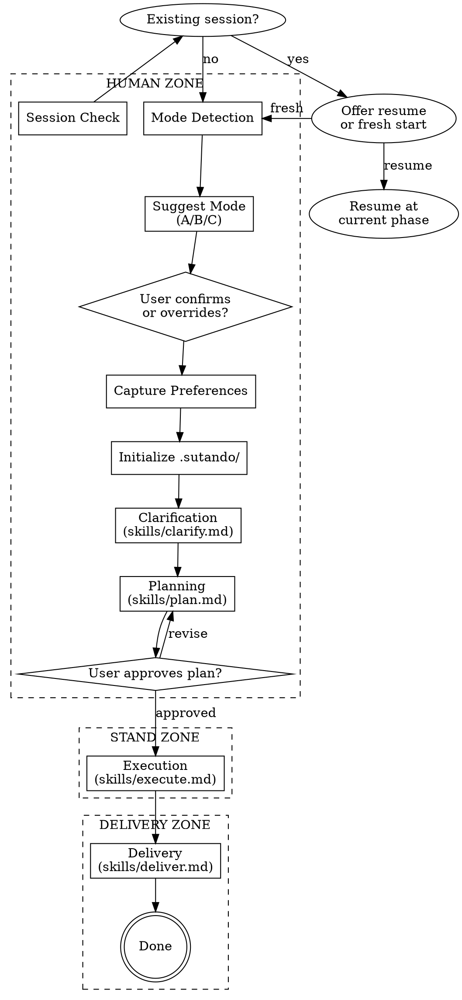

# Sutando

> Your Stand fights on your behalf — collaborative clarification, autonomous execution, verified delivery.

## Overview

Sutando is a two-zone workflow:
- **Human Zone** — Maximum collaboration to clarify requirements and approve the plan
- **Stand Zone** — Autonomous TDD execution with minimal human interruption
- **Delivery Zone** — Agent presents results, human verifies

The plan approval is the single gate between human collaboration and autonomous execution.

## Checklist

You MUST complete these steps in order:

1. **Session check** — Look for existing `.sutando/STATE.md`
2. **Mode detection** — Analyze request, suggest mode (A/B/C), let user confirm or override
3. **Preference capture** — Ask interruption tolerance (minimal/normal/checkpoint), default normal
4. **Initialize .sutando/** — Create project directory and config.json
5. **Clarification** — Read and follow `skills/clarify.md` for the chosen mode
6. **Planning** — Read and follow `skills/plan.md`
7. **Plan approval gate** — User MUST approve plan before execution begins
8. **Execution** — Read and follow `skills/execute.md`
9. **Delivery** — Read and follow `skills/deliver.md`

## Process Flow



<HARD-GATE>
Do NOT begin execution (skills/execute.md) until the user has explicitly approved the plan.
This is the boundary between human collaboration and autonomous work.
No exceptions.
</HARD-GATE>

## Step 1: Session Check

Check if `.sutando/STATE.md` exists in the project root.

**If it exists:**
> "I found an existing Sutando session. Current state: **[phase] phase, [progress].**
> - **Resume** from where we left off?
> - **Start fresh** (archives current `.sutando/` to `.sutando.bak/`)?"

If resume: read STATE.md, jump to the appropriate phase skill.
If fresh: `mv .sutando .sutando.bak`, proceed to mode detection.

**If it doesn't exist:** Proceed to mode detection.

## Step 2: Mode Detection

Analyze the user's request to suggest a clarification depth.

**Signals to evaluate:**

| Signal | Mode A (Quick) | Mode B (Structured) | Mode C (Deep) |
|--------|---------------|---------------------|----------------|
| Request length | Short, clear sentence | Moderate paragraph | Vague or ambitious |
| Codebase size | Small / single file | Medium feature | Large / multi-system |
| Ambiguity | None | Some design decisions | Many unknowns |
| Scope | Single change | Feature with components | Multi-phase project |

**Present transparently:**

> "Based on your request, I'd suggest **Mode [X]** ([name]) — [one sentence reasoning]. Modes available:
> - **A (Quick):** 3-5 focused questions, then go
> - **B (Structured):** Design dialogue, spec document, approach selection
> - **C (Deep):** Full research pipeline, requirements extraction, phased roadmap
>
> Go with [X], or pick a different mode?"

Wait for user response. Accept their choice.

## Step 3: Preference Capture

> "During implementation, how much should I check in?
> - **Minimal** — Only stop for true blockers (missing credentials, impossible requirements)
> - **Normal** (default) — I try 2-3 times on my own, then ask if stuck
> - **Checkpoint** — I pause after each major task for your thumbs-up
>
> Default is Normal. Press enter to accept, or pick one."

## Step 4: Initialize .sutando/

Create the project state directory:

```bash
mkdir -p .sutando/phases
```

Write `.sutando/config.json`:

```json
{
  "mode": "<user's choice>",
  "interruption": "<user's choice or 'normal'>",
  "parallelism": "adaptive",
  "created_at": "<ISO timestamp>"
}
```

Add `.sutando/` to `.gitignore` if not already present (the user's project shouldn't track Sutando's internal state by default).

## Step 5-9: Phase Execution

Read and follow the corresponding skill file for each phase:

- **Step 5:** Read `skills/clarify.md` — produces `.sutando/SPEC.md`
- **Step 6:** Read `skills/plan.md` — produces `.sutando/PLAN.md`
- **Step 7:** Hard gate — user approves plan
- **Step 8:** Read `skills/execute.md` — autonomous TDD loop
- **Step 9:** Read `skills/deliver.md` — summary + walkthrough + verification

Each skill file contains complete instructions for its phase. Follow them exactly.

## Red Flags — STOP and Re-read

| Thought | Reality |
|---------|---------|
| "This is too simple for Sutando" | Mode A exists for simple tasks. Use it. |
| "I can skip clarification" | Even Mode A asks 3-5 questions. |
| "The plan is obvious, skip to coding" | The plan IS the contract. Write it. |
| "I'll just fix this one more thing" | No "while I'm here" changes. Log it. |
| "Tests are passing, ship it" | Run verification FRESH before claiming done. |
| "I know what the user wants" | ASK. That's what the Human Zone is for. |
